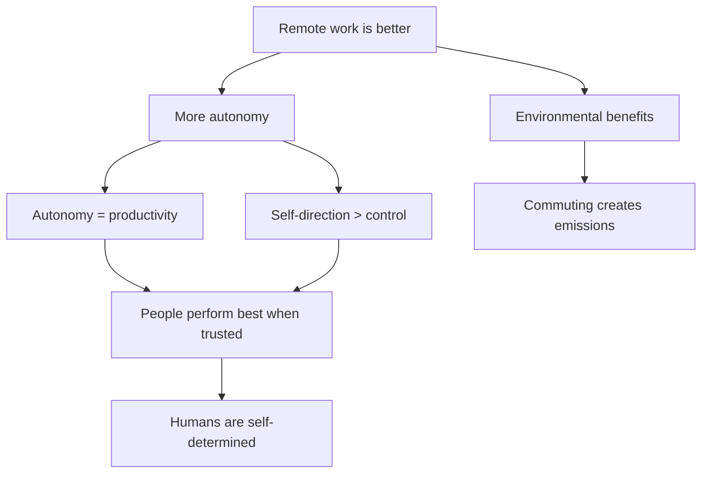
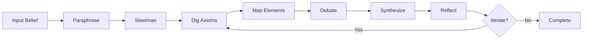

# UX Patterns & Interaction Design

Design patterns that make Axiom Explorer low-effort, high-clarity, and adaptable to different user styles.

---

## Core UX Principles

1. **Minimize user effort** - Typing should be optional, not required
2. **Maximize clarity** - Structure beats prose
3. **Adapt to style** - Support visual, textual, and kinesthetic preferences
4. **Show progress** - Always know where you are in the process
5. **Enable control** - User can adjust depth, pace, focus

---

## Numbered Suggestions

### Format

**Provide 5-8 contextual options at decision points**

Each suggestion should be:
- **Numbered** for easy selection (1-8)
- **2-4 sentences** explaining the option
- **Contextually relevant** to current exploration
- **Diverse** covering different categories/angles

**Example:**
```
Why might you believe "remote work is better than office work"?

1. (Personal experience) You've had negative office experiences - commute stress,
   interruptions, performative presence culture made you less productive and happy.

2. (Autonomy value) You prioritize flexibility and control over your environment,
   which remote work provides more of than traditional office structures.

3. (Data interpretation) You've seen studies showing remote workers report higher
   satisfaction and equivalent or better productivity in certain roles.

4. (Environmental concern) Remote work reduces commuting emissions, aligning with
   your environmental values and making it feel ethically superior.

5. (Tribal identity) You identify with tech/startup culture that values results
   over presence, and remote work signals alignment with that tribe.

6. (Unstated assumption) You're assuming "office work" means rigid 9-5 in cubicles,
   not hybrid or flexible office arrangements.

7. (Alternative framing) What if the real factor is autonomy/trust, not location—
   and some offices provide that while some remote jobs don't?

8. (Other) [Type your own reason]
```

### Usage Notes

**When to use:**
- Paraphrasing stage (multiple interpretations)
- Axiom drilling (possible presumptions)
- Emotional/tribal mapping (driver suggestions)
- Synthesis (application ideas)

**User can:**
- Select one number
- Select multiple: "1, 3, 5"
- Write custom: "8. [Actually it's because...]"
- Request more: "Show 5 more options"

---

## Template Filling

### Structured Formats

**Provide templates with guidance for custom input**

**Example: Belief Clarification Template**
```
Belief: [State your belief in one sentence]

Context: [Optional - What prompted this belief? When did you start believing it?]

Confidence: [1-10, where 10 = absolutely certain]

Stakes: [Low/Medium/High - How much does this belief affect your decisions?]

Open to changing: [Yes/No/Maybe - Are you willing to question this?]
```

**Example: Application Template**
```
Application Type: [Prompt improvement / Experiment / Build / Debate prep / Other]

Current situation: [What are you trying to accomplish?]

Constraints: [Time, resources, knowledge limits]

Success looks like: [How will you know if this works?]
```

### Inline Guidance

**Show examples and hints:**
```
Axiom identified: [e.g., "All human decisions are ultimately self-interested"]

Evidence for: [Cite studies, examples, or say "None, this is intuition"]

Evidence against: [What would falsify this? Any counterexamples?]

Confidence: [Certain/Confident/Uncertain/Speculating]
```

### Fill-in-the-Blank Style

**For faster iteration:**
```
I believe [BELIEF] because [REASON], which assumes [AXIOM].

If [AXIOM] is false, then [CONSEQUENCE].

A way to test this would be [EXPERIMENT].
```

User fills brackets, creates quick map.

---

## Visualizations

### Tables (Markdown)

**Comparative analysis:**

| Perspective | Core Axiom | Emotional Driver | Tribal Frame | Strength |
|-------------|-----------|------------------|--------------|----------|
| **Pro-remote** | Autonomy = productivity | Freedom, control | Tech/startup culture | 7/10 |
| **Pro-office** | Collaboration needs proximity | Belonging, energy | Traditional corporate | 6/10 |
| **Hybrid** | Context-dependent optimization | Flexibility, pragmatism | Results-oriented | 8/10 |

**Axiom drilling visualization:**

| Level | Question | Belief | Axiom |
|-------|----------|--------|-------|
| 0 | - | Remote work is better | [Starting belief] |
| 1 | Why? | More autonomy | Autonomy increases productivity |
| 2 | Why? | Self-direction > external control | People perform best when trusted |
| 3 | Why? | Intrinsic motivation is stronger | Humans are fundamentally self-determined |

**Evidence scoring:**

| Claim | Evidence Quality | Confidence | Source |
|-------|-----------------|------------|--------|
| Remote workers happier | Moderate | 70% | Owl Labs 2023 (n=2,000) |
| Equal productivity | Weak | 55% | Mixed studies, context-dependent |
| Better for environment | Strong | 85% | EPA emission data |

### Graphs (Mermaid)

**Belief tree:**


**ANS Quadrant mapping:**
```mermaid
quadrantChart
    title Belief Emotional States
    x-axis Low Energy --> High Energy
    y-axis Threat --> Safety
    quadrant-1 Fight (activism)
    quadrant-2 Fawn (people-pleasing)
    quadrant-3 Freeze (shutdown)
    quadrant-4 Flight (avoidance)
    "Remote work belief": [0.7, 0.6]
```

**Process flow:**


### When to Use Visuals

**Tables for:**
- Comparisons (multiple perspectives)
- Evidence assessment (scoring)
- Structured hierarchies (axiom levels)
- Progress tracking (status by step)

**Graphs for:**
- Relationships (belief trees)
- Processes (skill flow)
- Quadrants (ANS states, 2×2 matrices)
- Timelines (belief evolution)

**Ask preference:**
"Would you like this as a table, graph, or text summary?"

---

## Progress Indicators

### Status Bars

**Show where we are in the process:**

```
Progress: [=====>-----] 50% (Step 4 of 7: Map Elements)

Completed: ✅ Paraphrase, ✅ Steelman, ✅ Dig Axioms, ✅ Map Elements
Next: Multi-Devils Debate → Synthesize → Reflect
```

### Skill Stack Display

**At command start, show the plan:**

```
📋 Command: multi-side-debate
⏱️  Estimated time: 20-30 minutes

Skill Stack:
1. steelman-enhance (5 min) - Build strongest version
2. multi-devils-debate (15 min) - 3 rounds of perspectives
3. synthesize-apply (5 min) - Integrate findings

Ready to begin? [Yes / Adjust timing / Choose different command]
```

### Depth Indicators

**Show how deep we've gone:**

```
Axiom Depth: Level 3 of ~5

Surface ──→ Intermediate ──→ [ROOT]

We're approaching foundational assumptions. Go deeper or synthesize here?
```

---

## Inline Replies

### Respond in Context

**Allow user to reply directly after any section without re-quoting:**

```
=== Steelman Version ===
"Remote work is better because it provides autonomy, reduces environmental
impact, and leverages trust-based management that increases intrinsic motivation."

[Your reaction? Accurate / Missing something / Overstatement / Other]

User: "Missing something - also better for parents with childcare needs"

[Acknowledged! Adding to steelman...]
```

### Section-by-Section Feedback

**Don't wait for end to get input:**

After each skill step, quick check-in:
- ✅ This captures it well, continue
- 🔧 Close but needs adjustment: [explain]
- ❌ Off-track, let me clarify: [correct]
- ⏭️ Skip this section, move to next

---

## Opt-In Features

### Default vs Enhanced Modes

**Basic mode (default):**
- Core 7-step process
- Text-based output
- Essential questions only

**Enhanced mode (opt-in):**
- ANS quadrant mapping
- Detailed nuance (10-15 options vs 5-8)
- Visualizations (tables + graphs)
- Deeper axiom drilling (5 levels vs 3)
- Extended debate (4 perspectives vs 2)

**Prompt at start:**
"Standard exploration or enhanced mode (adds visualizations, ANS mapping, deeper analysis)?"

### Feature Flags

**User can toggle:**
- `--visuals` - Include tables and graphs
- `--ans` - Add ANS quadrant analysis
- `--deep` - Go 5 levels deep on axioms
- `--quick` - Skip optional steps, 50% faster
- `--evidence` - Emphasize data grounding, search more

**Example:**
"Run axiom-drill-down --visuals --deep on 'AI will replace knowledge work'"

---

## Adaptive Pacing

### Adjust to User Energy

**Signals to watch:**
- Short responses → User tired or disengaged, speed up
- Long thoughtful responses → User engaged, go deeper
- Questions → User confused, clarify more
- Pushback → User defensive, soften approach

**Adapt accordingly:**
```
[User seems tired]
"We've covered a lot. Quick version: 3 key axioms identified, 2 alternatives.
Synthesize now or continue?"

[User very engaged]
"You're bringing up great nuances. Want to explore that thread deeper before
moving to next step?"
```

### Breakpoints

**Offer exits/pauses:**
```
[After 15 minutes]
"We're halfway through. Pause here and come back later, or finish the exploration
now? (Can resume from this point)"

[If stuck]
"This thread seems tough to untangle. Skip to next axiom, try different angle,
or take a break?"
```

---

## Mobile-Friendly Patterns

### Shorter Outputs

**For small screens:**
- 3-5 options instead of 5-8
- Shorter explanations (1-2 sentences vs 3-4)
- Collapsible sections
- "Show more" buttons for details

### Tap-Friendly Selection

**Big touch targets:**
```
──────────────────────────────
│ 1. Emotional driver        │
│    (Autonomy and freedom)   │
──────────────────────────────
│ 2. Tribal identity          │
│    (Tech culture alignment) │
──────────────────────────────
│ 3. Data interpretation      │
│    (Studies show benefits)  │
──────────────────────────────
```

### Voice-First Option

**For hands-free:**
"I'll describe 5 options. Say the number when you hear one you want to explore..."

---

## Accessibility Considerations

### Screen Reader Friendly

- Semantic heading structure (H1, H2, H3)
- Alt text for graphs (describe visually)
- Linear navigation (no complex layouts)
- Clear labels for all inputs

### Neurodivergent Support

**For ADHD:**
- Numbered steps (reduces overwhelm)
- Progress indicators (shows end is reachable)
- Breakpoints (prevent fatigue)
- TL;DR summaries

**For autism:**
- Explicit structure (no ambiguity)
- Literal language when possible
- Clear expectations set upfront
- Social/emotional hints explained

**For dyslexia:**
- Bullet points over long paragraphs
- Key terms bolded
- Visual organization (tables/graphs)

---

## Export Formats

### At Completion

**Offer multiple formats:**

1. **Markdown document** - Full exploration with all sections
2. **Summary slide** - One-page visual overview
3. **Action checklist** - Just the applications/next steps
4. **Mermaid graph** - Visual belief map
5. **JSON/YAML** - Structured data for processing

**Example:**
```
Exploration complete! Export as:
[1] Full Markdown report
[2] One-page summary
[3] Action items only
[4] Visual map (Mermaid)
[5] Structured data (JSON)
[6] Multiple formats
```

---

## Customization & Themes

### Tone Adjustments

**User can request:**
- More formal / casual
- More questioning / assertive
- Simpler language / technical
- Shorter / more detailed

**Example:**
"Can you make this more conversational? I'm not writing a paper, just thinking out loud."

### Cultural Adaptation

**Awareness of:**
- Directness norms (Western vs Asian communication)
- Emotion expression (stoic vs expressive cultures)
- Authority framing (hierarchical vs egalitarian)
- Individual vs collective focus

Adjust tone and framing accordingly.

---

## Example: Full UX Flow

**Start:**
```
Welcome to Axiom Explorer!

What belief, idea, or prompt would you like to explore?

[Type here or select a template]
```

**Template selection:**
```
Common explorations:
1. Personal belief
2. Political/social issue
3. LLM prompt refinement
4. Product/business idea
5. Scientific hypothesis
6. Philosophical question
[Custom]
```

**Command selection:**
```
You chose: Personal belief - "Remote work is better than office work"

Recommended command: multi-side-debate (20-30 min)
- Explores multiple perspectives
- Maps emotional + tribal factors
- Provides balanced synthesis

[Start / Choose different command / Customize]
```

**Skill execution with inline feedback:**
```
Step 1/3: Steelman (Building strongest version...)

"Remote work is better because..."

[Review] ✅ Accurate / 🔧 Adjust / ❌ Off-track
```

**Visualization offer:**
```
Ready to map perspectives. Display as:
[1] Table (compare side-by-side)
[2] Tree diagram (visual hierarchy)
[3] Text summary (no graphics)
```

**Completion:**
```
Exploration complete! ✅

Key findings:
- 3 root axioms identified
- 2 emotional drivers mapped
- 4 perspectives synthesized
- 5 applications suggested

Export this map?
[Yes - format options] / [No - start new exploration] / [Iterate - go deeper]
```

---

## Summary: UX Pattern Selection

**Use numbered suggestions for:**
- Multiple interpretations needed
- Revealing blind spots
- Reducing typing

**Use templates for:**
- Structured input gathering
- Consistency across explorations
- Teaching the format

**Use visualizations for:**
- Complex comparisons
- Relationship mapping
- User prefers visual thinking

**Use progress indicators for:**
- Long explorations (>15 min)
- Multi-step processes
- Maintaining context

**Use inline replies for:**
- Quick corrections
- Section-by-section feedback
- Maintaining flow

**Use opt-ins for:**
- Advanced features
- Time/depth preferences
- Personal style adaptation

**Combine patterns** to create low-effort, high-clarity explorations that adapt to user needs.
