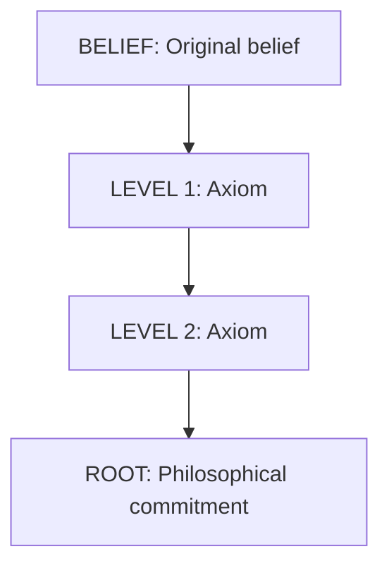

# dig-axioms (MULTI-TURN)

**Framework used:** ACH (Analysis of Competing Hypotheses)

**Purpose:** Use Socratic questioning ("why?") and proactive guessing to drill down 1-3 levels toward root philosophical presumptions underlying a belief.

**Multi-turn structure:** Each "why?" is a separate turn/file. User can pause, resume, or stop at any level.

**When to use:**
- After steelman has strengthened the belief
- Need to expose foundational assumptions
- Testing logical consistency of belief chain
- Finding points where belief becomes unfalsifiable

---

## Multi-Turn Structure

This skill executes across 3+ turns, with each turn representing one level of "why?":
- **Turn 1 (03a-level1.md):** First "why?" - surface axiom
- **Turn 2 (03b-level2.md):** Second "why?" - intermediate axiom
- **Turn 3 (03c-level3.md):** Third "why?" - root axiom
- **Synthesis (03-dig-axioms.md):** Complete hierarchy map

---

## Turn 1: Level 1 Input Contract

**Required:**
- `02-steelman.md` - Enhanced belief statement

**Format:**
```markdown
## Enhanced Belief Statement

"[statement]"
```

---

## Turn 1: Execution Steps

### Step 1: Frame the "Why?" Question
Convert enhanced belief into interrogative form:
> "Why do you believe [core claim from enhanced statement]?"

### Step 2: Generate Proactive Guesses (5-8 options)
Use proactive-guessing skill to create categorized options:

**Required categories:**
1. **Emotional** - Hope, fear, pride driving belief
2. **Tribal** - Identity, in-group alignment, signaling
3. **Rational** - Personal experience, observed patterns
4. **Rational** - Analogical reasoning, logical inference
5. **Philosophical** - Epistemological or ontological assumption
6. **Unconceived** - Alternative that undermines premise
7. **Other** - Blank for user's own answer

**Format for each:**
- Clear label: "[Category] [Short Name]"
- 2-4 sentence explanation
- Why this would support the belief
- What it assumes about reality/cognition

### Step 3: Present Options to User
Number options 1-8, clearly categorized.

### Step 4: Score Against Evidence (Optional)
Create table scoring each presumption:
- Likelihood (%)
- Supporting evidence
- Contradicting evidence

### Step 5: Document Selected Axiom
Once user selects or provides answer:
- Quote their selection/answer
- Explain why it's foundational
- Note secondary influences
- Identify key insight (what does this reveal?)

### Step 6: Formulate Level 1 Axiom Statement
Create concise axiom statement in quotes that captures the presumption.

---

## Turn 1: Output Contract

**File:** `03a-level1.md`

**Required sections:**
1. Question ("Why do you believe...")
2. Proactive Guessing: 5-8 Possible Presumptions (categorized)
3. Scoring Against Evidence (table)
4. Selected Level 1 Axiom (user's choice + rationale)
5. Level 1 Axiom Statement (quoted)
6. Metadata

**Template:**
```markdown
# Dig Axioms - Turn 1: Level 1

**Analysis ID:** axiom-<YYYYMMDD-HHMMSS>
**Timestamp:** <ISO timestamp>
**Previous step:** 02-steelman.md
**Next step:** 03b-level2.md
**Framework used:** ACH (Analysis of Competing Hypotheses)

---

## Question

**Why do you believe** [core claim]?

---

## Proactive Guessing: [5-8] Possible Presumptions

### 1. (Emotional) **[Short Name]**
[2-4 sentence explanation of how this emotional driver supports the belief]

### 2. (Tribal) **[Short Name]**
[2-4 sentence explanation of identity/in-group alignment]

### 3. (Rational) **[Short Name]**
[2-4 sentence explanation from personal experience]

### 4. (Rational) **[Short Name]**
[2-4 sentence explanation from analogical reasoning]

### 5. (Philosophical) **[Short Name]**
[2-4 sentence explanation of epistemological assumption]

### 6. (Philosophical) **[Short Name]**
[2-4 sentence explanation of ontological assumption]

### 7. (Unconceived) **[Short Name]**
[2-4 sentence explanation of alternative that undermines premise]

### 8. (Other/Insert Own)**_______________________________**

---

## Scoring Against Evidence

| Presumption | Likelihood | Supporting Evidence | Contradicting Evidence |
|-------------|-----------|---------------------|------------------------|
| 1. [Name] | [%] | [evidence] | [evidence] |
| 2. [Name] | [%] | [evidence] | [evidence] |
[...continue for all options]

---

## Selected Level 1 Axiom

**Primary:** **#[X] - [Name]**

**Rationale:**
- [Why this is foundational]
- [How it drives the belief]
- [What it reveals]

**Secondary influences:**
- #[Y] ([Name]) - [How it contributes]
- #[Z] ([Name]) - [How it contributes]

**Key insight:** [What this selection reveals about the belief structure]

---

## Level 1 Axiom Statement

**"[Concise axiom statement in quotes]"**

---

## Metadata

- Proactive guesses generated: [5-8]
- Categories covered: [list categories used]
- Selected axiom: #[X] ([Name])
- Confidence in selection: [60-95]%
- Ready for Level 2 drilling: Yes
```

---

## Turn 2: Level 2 Input Contract

**Required:**
- `03a-level1.md` - Level 1 axiom statement

---

## Turn 2: Execution Steps

Repeat the same process as Turn 1, but:
- Question becomes: "Why do you believe [Level 1 axiom]?"
- Proactive guesses address why Level 1 axiom is held
- Output is `03b-level2.md`
- Next step is `03c-level3.md`

---

## Turn 3: Level 3 Input Contract

**Required:**
- `03b-level2.md` - Level 2 axiom statement

---

## Turn 3: Execution Steps

Repeat the same process as Turn 1, but:
- Question becomes: "Why do you believe [Level 2 axiom]?"
- Focus on root philosophical commitments
- Output is `03c-level3.md`
- Next step is `03-dig-axioms.md` (synthesis)

**NOTE:** Level 3 often reaches unfalsifiable philosophical commitments (functionalism, empiricism, etc.). Document when bedrock is reached.

---

## Synthesis Input Contract

**Required:**
- `03a-level1.md`
- `03b-level2.md`
- `03c-level3.md`

---

## Synthesis: Execution Steps

### Step 1: Create Axiom Hierarchy Diagram
Use Mermaid or text diagram showing:
```
BELIEF → LEVEL 1 → LEVEL 2 → ROOT
```

### Step 2: Document Complete Chain
List each level with:
- Axiom statement
- Confidence if independent
- What it assumes

### Step 3: Identify Critical Vulnerabilities
Where does the chain become weakest?
- Which link has lowest confidence?
- Which assumption is most controversial?
- What would invalidate the chain?

### Step 4: Propose Critical Tests
What empirical tests could validate/invalidate axioms?

### Step 5: Update Overall Confidence
How confident in original belief given axiom stack?
- Multiply independent probabilities
- Or assess as dependent chain
- Document reasoning

---

## Synthesis: Output Contract

**File:** `03-dig-axioms.md`

**Required sections:**
1. Complete Axiom Hierarchy (diagram + text)
2. Level-by-Level Breakdown (all levels documented)
3. Critical Vulnerabilities (weakest links)
4. Critical Empirical Tests (what would resolve)
5. Confidence Assessment (updated based on axioms)
6. Metadata

**Template:**
```markdown
# Dig Axioms - Complete Hierarchy

**Analysis ID:** axiom-<YYYYMMDD-HHMMSS>
**Timestamp:** <ISO timestamp>
**Inputs:** 03a-level1.md, 03b-level2.md, 03c-level3.md
**Next step:** 04-map-elements.md
**Framework used:** ACH (Analysis of Competing Hypotheses)

---

## Complete Axiom Hierarchy



---

## Level-by-Level Breakdown

### Original Belief
**Statement:** "[belief]"
**Confidence:** [%]

### Level 1: [Name]
**Statement:** "[axiom]"
**Assumes:** [what it takes for granted]
**If false:** [what breaks]

### Level 2: [Name]
**Statement:** "[axiom]"
**Assumes:** [what it takes for granted]
**If false:** [what breaks]

### Root: [Name]
**Statement:** "[axiom]"
**Nature:** [Philosophical/metaphysical/epistemological]
**Status:** [Unfalsifiable/Testable]

---

## Critical Vulnerabilities

**Weakest link:** [Which axiom is most questionable]

**If this fails:** [What breaks down the chain]

**Controversy level:** [How disputed is root axiom]

---

## Critical Empirical Tests

1. **Test [Name]:** [What would validate/invalidate Level 1]
2. **Test [Name]:** [What would validate/invalidate Level 2]
3. **Test [Name]:** [What would validate/invalidate Root]

---

## Confidence Assessment

**Original belief confidence:** [%]

**Confidence accounting for axioms:**
- If axioms independent: [% × % × % = %]
- If axioms dependent: [% estimated]

**Adjusted confidence:** [%]

**Rationale:** [Why confidence changed or held]

---

## Metadata

- Levels reached: [1/2/3/more]
- Root axiom: [Name]
- Root type: [Philosophical/Empirical/etc]
- Confidence trajectory: [start]% → [end]%
- Ready for emotional/tribal mapping: Yes
```

---

## Quality Checks

Before completing each turn:
- [ ] Question clearly derived from previous axiom
- [ ] 5-8 proactive guesses covering all categories
- [ ] Each guess has clear explanation (2-4 sentences)
- [ ] Scoring table (if used) assesses all options
- [ ] Selected axiom well-justified
- [ ] Axiom statement is concise and clear

Before completing synthesis:
- [ ] All levels integrated into hierarchy
- [ ] Diagram clearly shows chain
- [ ] Vulnerabilities identified
- [ ] Tests proposed for each level
- [ ] Confidence updated with reasoning

---

## Example from Live Execution

**Level 1 question:**
> "Why do you believe that structured framework catalogs enable AI to pattern-match and humans to learn through cognitive apprenticeship?"

**Proactive guesses (8 total):**
1. (Emotional) Hope for Leverage
2. (Tribal) AI-Optimist Identity
3. (Rational) Personal Experience
4. **(Rational) Analogical Reasoning from Expertise Research** ← selected
5. (Philosophical) Knowledge Externalization Assumption
6. (Philosophical) Learning-by-Exposure Assumption
7. (Unconceived) What if thinking ISN'T pattern-matching?
8. (Other) [blank]

**Level 1 axiom:**
> "Expertise in thinking operates like expertise in chess or medical diagnosis—it's primarily pattern recognition built through repeated exposure to exemplars."

**Level 2 question:**
> "Why do you believe expertise is primarily pattern recognition?"

**Level 2 axiom:**
> "Cognition is fundamentally computational—thinking is information processing over mental representations."

**Level 3 question:**
> "Why do you believe cognition is computational?"

**Root axiom:**
> "Functionalism: Mental states are defined by their functional role, not their physical substrate. Intelligence is substrate-independent."

**Final hierarchy:**
```
BELIEF (Framework cataloging works)
    ↓
LEVEL 1 (Expertise = Pattern Recognition)
    ↓
LEVEL 2 (Computational Theory of Mind)
    ↓
ROOT (Functionalism)
```

**Critical vulnerability:** If functionalism is false (substrate matters more than function), entire chain collapses.

**Confidence:** 70% → 50-60% after acknowledging axiom dependencies
