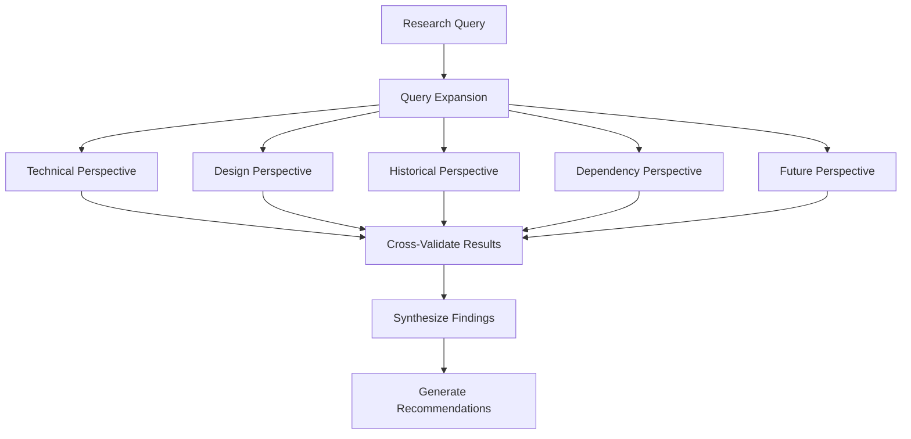

# lev-research/perspectives - 5-Perspective Research Pattern

## Lev Concept

**What is multi-perspective research?**

Single-perspective searches miss critical context. The 5-perspective pattern orchestrates parallel searches across complementary viewpoints to surface hidden connections and comprehensive understanding.

**Why 5 perspectives?**

Based on `~/lev/research/timetravel` methodology:
- **Technical** - How it's built (code, architecture)
- **Design** - Why it's built this way (decisions, rationale)
- **Historical** - How it evolved (changes, lessons)
- **Dependency** - What connects to it (integration, dependencies)
- **Future** - Where it's going (TODOs, roadmap)

**When to use this pattern:**
- Complex research requiring depth
- Architecture exploration
- Technology assessment
- Gap analysis
- Understanding unfamiliar systems

---

## Research Orchestration Flow



---

## CLI Commands

### Invoke 5-Perspective Research

```bash
# Auto-expand query to 5 perspectives
lev-research "authentication" --perspectives=all

# Specific perspectives only
lev-research "caching" --perspectives=technical,dependency

# With context window
lev-research "API design" --perspectives=all --context=5
```

### Direct Perspective Calls (Advanced)

```bash
# Technical perspective only
lev get "authentication implementation patterns" --indexes codebase

# Design perspective only
lev get "why JWT chosen over sessions" --indexes documentation

# Historical perspective only
lev get "auth refactoring history" --indexes sessions

# Dependency perspective only
lev get "what depends on auth" --indexes codebase,tasks

# Future perspective only
lev get "TODO authentication improvements" --indexes tasks
```

---

## Workflows

### Workflow 1: Query Expansion (Phase 1)

Transform single query into 5 perspective-specific searches.

**Input:** User query (e.g., "How does authentication work?")

**Process:**
```yaml
query_expansion:
  original: "How does authentication work?"

  expanded_queries:
    technical:
      - "authentication implementation patterns"
      - "auth middleware architecture"
      - "session vs token authentication"

    design:
      - "authentication decisions ADR"
      - "why current auth approach"
      - "auth security design"

    historical:
      - "authentication refactoring history"
      - "auth migration discussions"
      - "previous auth implementations"

    dependency:
      - "what depends on auth"
      - "auth library usage"
      - "auth integration points"

    future:
      - "TODO authentication improvements"
      - "auth security issues"
      - "planned auth changes"
```

**Output:** 3-5 queries per perspective (15-25 total queries)

---

### Workflow 2: Parallel Search Execution (Phase 2)

Execute all perspective queries in parallel using `lev get`.

**Process:**
```bash
# Execute searches across perspectives
lev get "authentication implementation patterns" --indexes codebase,documentation
lev get "auth middleware architecture" --indexes codebase
lev get "authentication decisions ADR" --indexes documentation,sessions
lev get "what depends on auth" --indexes codebase,tasks
lev get "TODO authentication improvements" --indexes tasks

# External research (if needed)
# Uses exa-plus for prior art and industry patterns
skill://exa-plus "authentication patterns 2025"
```

**Output:** Raw results per perspective (deduplicate in next phase)

---

### Workflow 3: Cross-Validation (Phase 3)

Merge and validate results across perspectives.

**Process:**
1. **Deduplicate** - Remove duplicate files/results across perspectives
2. **Identify consensus** - Multiple perspectives citing same files = high relevance
3. **Flag gaps** - Perspectives with 0 results = knowledge gap
4. **Rank by coverage** - Results mentioned in 3+ perspectives rank highest

**Consensus scoring:**
```
File mentioned in 1 perspective:   score = 0.2
File mentioned in 2 perspectives:  score = 0.5
File mentioned in 3 perspectives:  score = 0.8
File mentioned in 4+ perspectives: score = 1.0
```

**Output:** Ranked, deduplicated results with consensus scores

---

### Workflow 4: Synthesis (Phase 4)

Integrate findings into coherent narrative.

**Output structure:**
```markdown
# Research: {Topic}

## Overview
{High-level summary from all perspectives}

## Technical Implementation
{Code locations, patterns, architecture}
- Key files: {list}
- Patterns used: {list}

## Design Decisions
{Why things work this way}
- Decision rationale: {ADRs, docs}
- Alternatives considered: {list}

## Historical Context
{Evolution, refactorings, lessons}
- Major changes: {timeline}
- Lessons learned: {insights}

## Dependencies & Integration
{What connects to what}
- Dependencies: {list}
- Integration points: {list}

## Future Trajectory
{Planned changes, TODOs}
- Roadmap: {list}
- Technical debt: {list}
- Opportunities: {list}

## Recommendations
{Actionable next steps based on findings}
```

---

## Research Perspectives (Details)

### 1. Technical Implementation
**Focus:** Architecture, code structure, technical details
**Tools:** `lev get` with codebase index
**Output:** Code locations, patterns, implementation details

**Example queries:**
- "how {component} is implemented"
- "{feature} code structure"
- "{technology} usage patterns"

---

### 2. Design Decisions
**Focus:** Why things work this way, ADRs, rationale
**Tools:** `lev get` with documentation index
**Output:** Architecture decisions, design docs, principles

**Example queries:**
- "why {choice} over {alternative}"
- "{component} design rationale"
- "ADR {topic}"

---

### 3. Historical Context
**Focus:** Evolution over time, refactorings, lessons learned
**Tools:** `lev get` with sessions index + git history
**Output:** Past discussions, changes, context

**Example queries:**
- "{component} refactoring history"
- "migration from {old} to {new}"
- "lessons learned {topic}"

---

### 4. Dependencies & Integration
**Focus:** What connects to what, integration points, dependencies
**Tools:** `lev get` with codebase + tasks indexes
**Output:** Dependency graph, integration patterns

**Example queries:**
- "what depends on {component}"
- "{component} integration points"
- "{library} usage across codebase"

---

### 5. Future Trajectory
**Focus:** Planned changes, TODOs, open questions
**Tools:** `lev get` with tasks index
**Output:** Roadmap, technical debt, opportunities

**Example queries:**
- "TODO {topic}"
- "planned {feature} improvements"
- "{component} known issues"

---

## Relates

### Depends On
- `lev-find` - Executes all perspective searches
- `lev-research/expansion` - Generates expanded queries per perspective

### Works With
- `lev-research/templates` - Uses 5 perspectives for template-based research
- `exa-plus` - External web/GitHub search for prior art
- `deep-research` - Tavily synthesis for comprehensive analysis

### Enables
- `lev-cdo` - Planning based on comprehensive research
- `lev-align` - Architecture validation using historical context
- `bd` - Task creation from future perspective gaps

---

## Tips

**Maximize consensus:**
- Look for files mentioned in 3+ perspectives
- High consensus = reliable, well-documented

**Investigate gaps:**
- Perspective with 0 results = knowledge gap
- Missing technical docs? Missing design rationale?

**Balance depth vs breadth:**
- 3 queries per perspective = focused
- 5 queries per perspective = comprehensive
- 10+ queries per perspective = exhaustive (use for critical research)

**Iterate when stuck:**
- Use domain expansion ladder (lev-research/expansion)
- Climb from specific to general until results found
