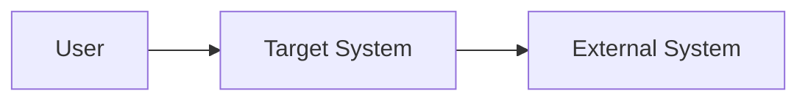
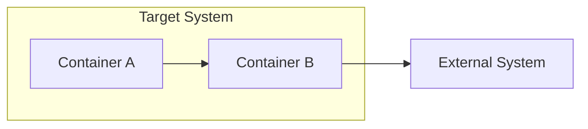
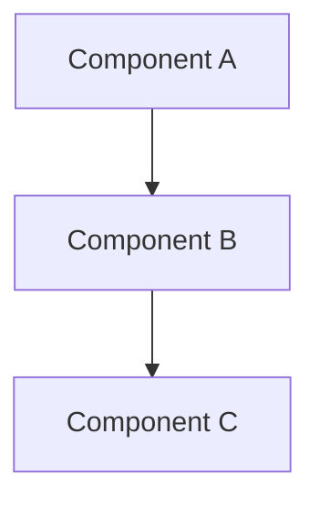
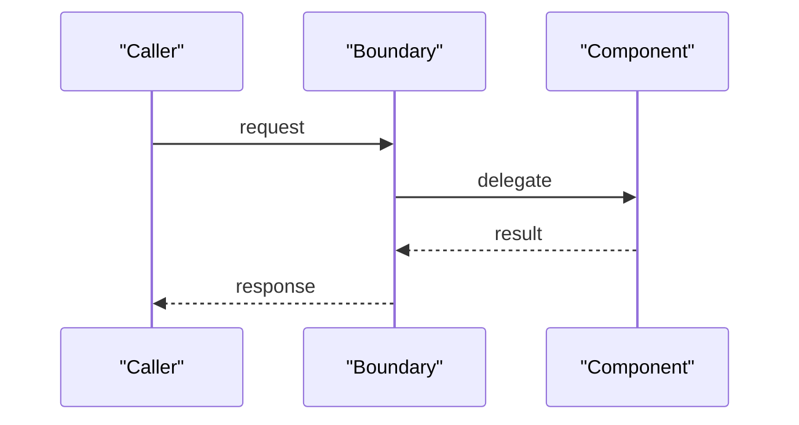

# {{TITLE}} — Behavioral Specification

## How To Fill This Out

Use this template for SDLC behavioral specs. A spec defines the target system and its contract. It is not a design doc and it is not an execution plan.

Use uncertainty markers when needed:
- `[tbd]`
- `[unknown]`
- `[theory]`
- `[maybe: ..., confidence: ##%]`

Good:
- "This spec defines target behavior with BDD and contract details."
- "Unknowns are labeled explicitly instead of hidden."

Bad:
- "This spec is really just a roadmap."
- "This spec mixes execution chores directly into the contract."

## Executive Summary
<!--
PURPOSE: Orient the reader in 2-3 sentences. What system/module does this spec define?
PROCESS: Write LAST, after all other sections are filled. Summarize the what and why.
GOOD: "Defines the transcription validation pipeline: input filtering, hallucination detection,
      and confidence scoring. Ensures only verified ATC transcriptions reach downstream consumers."
BAD:  "This document describes the transcription system."
-->

## Context
<!--
PURPOSE: Ground the spec in system reality — constraints, related specs, architectural position.
PROCESS: List the architectural constraints first, then link to related specs explicitly.
GOOD: "Operates within the ASR daemon (pipes-and-filters). Receives raw Whisper output via NATS
      subject `asr.transcribed`. Must complete within 50ms to maintain pipeline throughput.
      Related: spec-session.md (downstream consumer), spec-daemon.md (hosting daemon)."
BAD:  "This is part of the transcription system."
-->

### Target State
<!--
PURPOSE: Define the measurable end state this spec targets. Code catches up to THIS.
PROCESS: Describe what the system WILL do, not what it does now. Include measurable criteria.
GOOD: "ValidationEngine runs 3 strategy passes (hallucination, grammar, confidence) in <50ms.
      Each strategy independently toggleable via ValidationConfig. Circuit breaker trips after
      5 consecutive failures within 30s window."
BAD:  "The system will be improved to handle validation better."
-->

## User Scenarios (BDD)
<!--
PURPOSE: Concrete behavioral examples that seed test cases. Each scenario = one test.
PROCESS: Write scenarios BEFORE the behavioral spec. Use Given/When/Then strictly.
         Cover happy path, edge cases, and failure modes. Number them for cross-referencing.
GOOD: Full Gherkin with specific values, not vague descriptions.
BAD:  "Scenario: It should work correctly" or scenarios with no concrete values.
-->

### Scenario 1: {{SCENARIO_NAME}}
```gherkin
Feature: {{FEATURE_NAME}}
  As a {{ROLE}}
  I want {{GOAL}}
  So that {{BENEFIT}}

  Scenario: {{SCENARIO}}
    Given {{PRECONDITION}}
    When {{ACTION}}
    Then {{EXPECTED_RESULT}}
```

## Behavioral Specification

### Inputs
<!--
PURPOSE: Define input types, schemas, validation rules. This is the contract boundary.
PROCESS: List every input with type, source, and validation rule. Be exhaustive.
GOOD: "audio_chunk: bytes (PCM16 mono 16kHz, max 30s). Source: NATS `asr.raw`. Reject if
      sample_rate != 16000 or channels != 1."
BAD:  "Takes audio input."
-->

### Processing
<!--
PURPOSE: Step-by-step processing logic, state transitions, decision points.
PROCESS: Number each step. For branching logic, use decision trees. For state machines,
         list states + transitions + guards.
GOOD: "1. Receive chunk → 2. Run VAD (silero, threshold 0.5) → 3. If speech detected,
      buffer until silence > 300ms → 4. Send buffered segment to Whisper → 5. Run validation
      pipeline on result → 6. If valid, publish to asr.validated"
BAD:  "Process the audio and validate it."
-->

### Outputs
<!--
PURPOSE: Define output types, schemas, side effects. Downstream contracts depend on this.
PROCESS: List every output with type, destination, and conditions for emission.
GOOD: "ValidatedTranscription { text: str, confidence: float, strategies_passed: list[str] }
      Published to NATS `asr.validated`. Side effect: emit transcription_validated counter."
BAD:  "Outputs the result."
-->

### Error Handling
<!--
PURPOSE: Define how each failure mode is handled. No silent drops. No swallowed errors.
PROCESS: For each error: what triggers it, what happens, where it's reported.
GOOD: "Whisper timeout (>5s): circuit breaker increment, log structured error with trace_id,
      return empty result with error flag. After 5 failures in 30s: trip breaker, stop processing,
      emit circuit_breaker_tripped metric."
BAD:  "Errors are handled appropriately."
-->

### Performance
<!--
PURPOSE: Latency, throughput, resource constraints. Measurable, not aspirational.
PROCESS: Define p50/p95/p99 targets. Specify resource limits (CPU, memory, GPU).
GOOD: "Validation pipeline: p50 < 10ms, p95 < 30ms, p99 < 50ms. Memory: < 50MB resident.
      No GPU required. Throughput: 100 chunks/sec sustained."
BAD:  "Should be fast enough for real-time use."
-->

## FMEA / Risk Analysis
<!--
PURPOSE: Identify failure modes BEFORE they happen. This section seeds test cases and
         validation gate generation. Lives IN the spec alongside BDD — not in chores.
PROCESS: 3 passes — (1) brainstorm failure modes for each processing step,
         (2) score severity/occurrence/detection 1-10, (3) prioritize by RPN.
         Update as system evolves. High RPN items become P0 test cases.
GOOD: "Whisper hallucination passes as valid ATC → RPN 270 (S:9 x O:6 x D:5).
      Mitigation: HallucinationFilter strategy with known-phrase dictionary."
BAD:  "System might have issues with transcription accuracy."
SCORING: Severity (1=negligible, 10=catastrophic), Occurrence (1=rare, 10=frequent),
         Detection (1=always caught, 10=invisible). RPN = S x O x D.
-->

| # | Failure Mode | Severity | Occurrence | Detection | RPN | Mitigation | Test Case |
|---|-------------|----------|------------|-----------|-----|------------|-----------|
| 1 | {{FAILURE_MODE}} | {{S}} | {{O}} | {{D}} | {{RPN}} | {{MITIGATION}} | {{TEST_REF}} |

## Quality Attributes
<!--
PURPOSE: Prioritized quality scenarios from architectural analysis. Trade-offs made explicit.
PROCESS: Use H/M/L priority from /arch utility tree. Each attribute gets a concrete scenario
         with stimulus, response, and measure. State trade-offs explicitly.
GOOD: "Reliability [H]: When Whisper returns empty string (stimulus), system retries once
      then marks as failed (response), within 100ms (measure). Trade-off: latency increases
      by ~50ms for retry, acceptable for reliability gain."
BAD:  "The system should be reliable."
-->

### {{ATTRIBUTE_NAME}} [H/M/L]
- **Scenario:** {{STIMULUS}} → {{RESPONSE}} within {{MEASURE}}
- **Trade-off:** {{WHAT_WE_GIVE_UP}} for {{WHAT_WE_GAIN}}

## ATAM / Trade-off Analysis
<!--
PURPOSE: Capture architectural drivers, trade-offs, sensitivity points, and recommendation rationale.
PROCESS: Use when the spec has architectural implications or competing quality attributes. Start with
         a utility tree, then compare 2-3 candidate approaches. If the change is trivial, explicitly
         mark this section as "not needed for this spec".
GOOD: "Option A optimizes simplicity but sacrifices observability. Option B adds explicit event typing
      and wins on modifiability at the cost of one extra adapter layer."
BAD:  "We picked this because it felt cleaner."
-->

### Utility Tree

```text
[Quality Attribute]
  |
  +-- [Refinement]
       |
       +-- (H,H) Scenario: <stimulus> -> <response> | <measure>
       +-- (M,H) Scenario: ...
```

### Candidate Approaches

| Approach | Description | Quality Attributes Optimized | Trade-offs |
|----------|-------------|------------------------------|------------|
| Option A | {{OPTION_A}} | {{QA_SET}} | {{TRADE_OFF}} |
| Option B | {{OPTION_B}} | {{QA_SET}} | {{TRADE_OFF}} |
| Option C | {{OPTION_C}} | {{QA_SET}} | {{TRADE_OFF}} |

### Sensitivity Points

- Point 1: What input/threshold/decision is highly sensitive and why
- Point 2: What small change materially shifts an outcome

### Recommendation

- **Chosen approach:** {{CHOSEN_OPTION}}
- **Why:** {{RATIONALE}}
- **What is deliberately sacrificed:** {{SACRIFICE}}

## C1-C4 Views
<!--
PURPOSE: Give lightweight architecture views when the spec spans multiple systems, containers,
         components, or a non-trivial call flow. These diagrams are optional but strongly recommended
         for cross-boundary work.
PROCESS: Use Mermaid. Fill only the levels that add clarity. If a level is unnecessary, say so.
GOOD: "C1 shows external systems and trust boundaries; C2 shows FE/DXL/container split; C3 shows
      the target internal modules; C4 shows the critical request/response call flow."
BAD:  "Draw boxes with no labels" or "Use prose when a diagram would clarify ownership."
-->

### C1: System Context



### C2: Containers



### C3: Components



### C4: Code / Interaction Flow



## MoSCoW Priorities
<!--
PURPOSE: Separate the essential contract from adjacent nice-to-haves and explicitly call out what
         is out of scope for the current spec.
PROCESS: Populate every category. If a category is empty, write "None". Keep items specific and
         testable, not vague aspirations.
GOOD: "Must: emit typed event X; Should: expose devLogger topic Y; Won't: generalize to all providers now."
BAD:  "Must: make it better" or "Could: maybe do some cleanup."
-->

### Must

- Requirement 1
- Requirement 2

### Should

- Requirement 1
- Requirement 2

### Could

- Requirement 1
- Requirement 2

### Won't (Now)

- Explicitly out-of-scope item 1
- Explicitly out-of-scope item 2

## Fitness Functions
<!--
PURPOSE: Automated governance checks with thresholds. Run in CI or validation gates.
PROCESS: For each quality attribute, define a measurable check that can run automatically.
         Include the command, threshold, and what happens on failure.
GOOD: "validation_latency_p95: `just bench-validation` must report p95 < 50ms. Gate: block merge."
BAD:  "Check that performance is acceptable."
-->

| Function | Command | Threshold | Gate |
|----------|---------|-----------|------|
| {{NAME}} | {{COMMAND}} | {{THRESHOLD}} | enforced / declared |

## Contract

### Dependencies
<!--
PURPOSE: External services, packages, skills required. Be specific about versions.
PROCESS: List every dependency with version constraint and why it's needed.
-->

### Integration Points
<!--
PURPOSE: APIs, events, hooks this spec touches. Define the contract at each boundary.
PROCESS: For each integration: protocol, subject/endpoint, payload schema, error contract.
-->

### Breaking Changes
<!--
PURPOSE: What existing behavior this changes. Downstream consumers need to know.
PROCESS: List every behavioral change that could break existing consumers.
-->

## Cross-References
<!--
PURPOSE: Explicit links to related specs, plans, and architecture docs.
PROCESS: For each reference: what it is, why it matters, and what section is relevant.
GOOD: "spec-session.md Section 'Clarification Flow' — consumes our PARAM_REJECTED event.
      spec-daemon.md Section 'Lifecycle' — hosts this module's runtime.
      plan-bugfix-transcription-wiring.md — tracks implementation gaps against this spec."
BAD:  "See other docs."
-->

| Document | Section | Relationship |
|----------|---------|-------------|
| {{DOC_PATH}} | {{SECTION}} | {{HOW_RELATED}} |

## Implementation Guidance

### Recommended Skills
<!-- Skill IDs discovered during design/spec routing -->

### Team Structure
<!-- Recommended execution strategy: direct / ephemeral subagents / formal team -->

### Workstreams
<!-- If team/subagents: workstream definitions with assignments -->

## BD Task Decomposition

### Epic Mapping
<!-- List required epics and why they exist -->

| Epic ID | Title | Scope | Success Signal |
|---------|-------|-------|----------------|
| {{EPIC_ID}} | {{EPIC_TITLE}} | {{EPIC_SCOPE}} | {{EPIC_SUCCESS_SIGNAL}} |

### Task Breakdown
<!-- Decompose spec into executable BD tasks; map each task to scenarios/contracts -->

| Task ID | Summary | Linked Scenario(s) | Owner | Acceptance Signal |
|---------|---------|--------------------|-------|-------------------|
| {{TASK_ID}} | {{TASK_SUMMARY}} | {{SCENARIO_REF}} | {{OWNER}} | {{ACCEPTANCE_SIGNAL}} |

### Dependency Ordering

| Blocking Task | Dependent Task | Reason |
|---------------|----------------|--------|
| {{BLOCKING_TASK}} | {{DEPENDENT_TASK}} | {{DEPENDENCY_REASON}} |

## Test Coverage

### Unit Tests
<!-- Key test cases derived from BDD scenarios and FMEA table -->

### Integration Tests
<!-- Cross-boundary test scenarios -->

### E2E Verification
<!-- End-to-end smoke test command -->

## Success Criteria
<!--
PURPOSE: Measurable acceptance criteria. When are we DONE?
PROCESS: List concrete, binary (pass/fail) criteria. No subjective assessments.
GOOD: "All BDD scenarios pass. All FMEA items with RPN > 100 have test coverage.
      Fitness functions pass in CI. No silent error paths."
BAD:  "System works correctly and is well-tested."
-->

## Rollback Plan
<!-- How to safely revert this spec's changes if execution fails -->

### Rollback Trigger
<!-- Objective condition that triggers rollback -->

### Rollback Steps
1. {{ROLLBACK_STEP_1}}
2. {{ROLLBACK_STEP_2}}
3. {{ROLLBACK_STEP_3}}

### Data/State Recovery
<!-- How to recover data, state, or config safely -->

## Open Questions
<!--
PURPOSE: Unresolved decisions, risks, unknowns. Track them, don't hide them.
PROCESS: Each question gets: context (why it matters), options, and deadline for resolution.
-->
